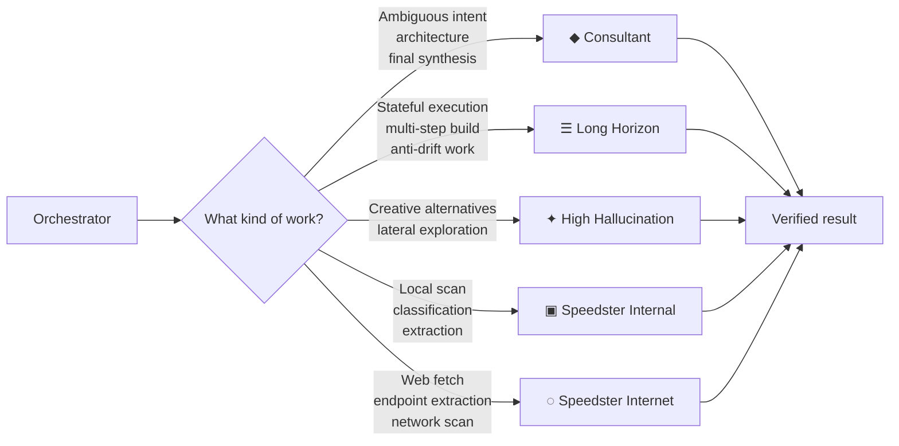
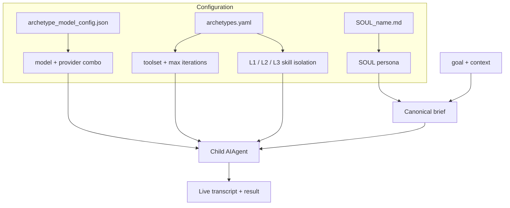

<div align="center">

# Hermes Archetype Router

### One subagent is not a system.

**Five specialist delegation tools for Hermes Agent — each with its own model, persona, toolset, execution horizon, and isolated skill context.**

[](https://github.com/njay-pro/hermes-archetype-subagent/releases/latest)
[](https://github.com/njay-pro/hermes-archetype-subagent/actions/workflows/test.yml)
[](LICENSE)
[](https://github.com/NousResearch/hermes-agent)

[Why it exists](#the-problem-is-not-delegation-it-is-fit) · [Meet the archetypes](#five-archetypes-five-jobs) · [Use it](#use-it-in-60-seconds) · [Install](#installation-let-hermes-do-it) · [Documentation](#go-deeper)

</div>

---

## The problem is not delegation. It is fit.

Hermes already knows how to spawn a subagent. Native `delegate_task` is excellent at that job: give it a goal, create a child agent, run the work.

But a real orchestration system needs another decision **before** the child starts:

- Does this job need frontier reasoning or long-horizon stability?
- Should the agent have a terminal, only local files, or only the web?
- Which procedural skills belong in its context — and which ones are noise?
- Is the desired output prose, a schema, or a deterministic extraction?
- How far should the agent be allowed to run?

Pasting a larger prompt into one generic subagent does not solve this. It just moves the routing problem into prose.

**Hermes Archetype Router turns those decisions into five explicit tools.** The orchestrator chooses the kind of mind the task needs; the plugin assembles the right child around it.



> **The plugin does not replace `delegate_task`.** It preserves the native delegation shape and adds a configurable archetype layer above it.

---

## Five archetypes. Five jobs.

| When the work needs… | Call | The posture | Default tools | Horizon |
|---|---|---|---|---:|
| Raw nuance, architectural judgment, intent distillation | `delegate_task_consultant` | **◆ Consultant** — pass the friction, resolve the system | terminal · file · web | 50 |
| Reliable, stateful, multi-step execution | `delegate_task_long_horizon` | **☰ Workhorse** — self-manage the plan, resist drift | terminal · file · web | 100 |
| Three alternatives, lateral thinking, expressive exploration | `delegate_task_high_hallucination` | **✦ Creative** — explore widely, stay grounded | terminal · file · web | 40 |
| Fast local file scanning and deterministic extraction | `delegate_task_speedster_internal` | **▣ Local speedster** — execute a shaped tree | file only | 15 |
| Fast web fetching and endpoint extraction | `delegate_task_speedster_internet` | **◌ Network speedster** — fetch, filter, return | web only | 20 |

The distinction is operational, not decorative. A speedster is intentionally narrow. A long-horizon worker is intentionally patient. A creative agent is allowed to diverge — inside a bounded horizon. The tool name communicates that contract to the orchestrator before any prompt is written.

### A simple routing rule

```text
Need to understand the problem?        → consultant
Need to execute the solution?          → long_horizon
Need distinct creative directions?     → high_hallucination
Need to scan local files quickly?       → speedster_internal
Need to fetch the web quickly?          → speedster_internet
```

> [!IMPORTANT]
> Speedsters expect a pre-shaped `STEP 1 → STEP 2 → ...` execution tree. Give one an open-ended request like “audit this codebase” and it may return `EXECUTION_FAILURE / NO_EXECUTION_TREE_PROVIDED`. That is a guardrail, not a bug. Route open-ended work to Consultant or Long Horizon.

---

## What changes under the hood

Each tool builds a child agent from five independent layers:



| Layer | Source of truth | What it controls |
|---|---|---|
| **Model** | `archetype_model_config.json` | provider, model combo, fallback information |
| **Mechanics** | `archetypes.yaml` | toolsets, iteration cap, output schema, default-disabled skills |
| **Identity** | `SOUL_<name>.md` | role, briefing posture, anti-patterns, escalation behavior |
| **Per-call context** | tool arguments | goal, context, preloaded files, schema/model/skill overrides |
| **Observability** | native-compatible live logs | progress, manifests, metadata, dashboard rendering |

Model config and mechanical config reload on file modification. SOUL files are read on every call. You can retune the team without rewriting orchestration code.

---

## Use it in 60 seconds

```python
# Resolve an architectural decision.
delegate_task_consultant(
    goal="Analyze the auth bottleneck and recommend one architecture.",
    context="Python, FastAPI, Redis. Current baseline: 10K requests/second.",
)

# Hand a stable worker the implementation mission.
delegate_task_long_horizon(
    goal="Implement the selected auth architecture and verify the full test suite.",
    context="The architecture decision is locked. Preserve public API behavior.",
)

# Explore before committing to one visual direction.
delegate_task_high_hallucination(
    goal="Create exactly three distinct launch concepts for a luxury lighting line.",
    context="Audience: architects and high-end hospitality studios.",
    output_schema_override={
        "type": "array",
        "items": {"type": "object"},
        "minItems": 3,
        "maxItems": 3,
    },
)
```

Need a specific file in the agent's context from the first token?

```python
delegate_task_long_horizon(
    goal="Execute the approved migration described in the attached plan.",
    preload_files=["/absolute/path/to/MIGRATION_PLAN.md"],
)
```

Need three sibling tasks at once? The plugin preserves native-style batch mode and dispatches the tasks in parallel under the same archetype:

```python
delegate_task_speedster_internet(
    tasks=[
        {"goal": "STEP 1: Fetch release A. STEP 2: Extract breaking changes."},
        {"goal": "STEP 1: Fetch release B. STEP 2: Extract breaking changes."},
        {"goal": "STEP 1: Fetch release C. STEP 2: Extract breaking changes."},
    ]
)
```

All five tools preserve the familiar native slots — `goal`, `context`, `tasks`, `max_iterations`, `role`, `background`, `parent_agent` — and add four overrides:

- `output_schema_override`
- `skill_include_override` / `skill_exclude_override`
- `model_override`
- `preload_files`

See the full [API reference](docs/API.md).

---

## Skill isolation without context sludge

A specialist should not inherit every skill the parent happens to know.

The router resolves subagent skills in three layers:

1. **OMCA baseline** — reusable `omca-*`, `omca_*`, `knows_*`, `nodes_*`, and `subflows_*` capabilities.
2. **Config safety net** — pollution-prone skills (currently `honcho-*`) stay off by default.
3. **Per-call decision** — the orchestrator can narrow to an exact whitelist or add an exclusion for this one job.

```python
delegate_task_speedster_internal(
    goal="STEP 1: Read the image bank. STEP 2: Return matching asset paths.",
    skill_include_override=["nodes_vector-search"],
)
```

The isolation applies while the child prompt is constructed **and** while the child runs. The parent agent's tool state is never mutated.

---

## Installation: let Hermes do it

This plugin intentionally follows Hermes internals closely: child-agent construction, provider resolution, profile propagation, live transcripts, and active-subagent registration. An agent can inspect your actual profile topology and install it more safely than a generic shell snippet can.

Copy this into Hermes:

````markdown
Install Hermes Archetype Router v1.0.0 from:
https://github.com/njay-pro/hermes-archetype-subagent

Do the installation end-to-end:
1. Clone tag v1.0.0 to ~/.hermes/plugins/archetype-router.
2. Install its development and test dependencies with `uv sync --extra dev --extra test`.
3. Discover every Hermes profile under ~/.hermes/profiles/ and symlink each
   profile's plugins/archetype-router to the canonical clone.
4. Read archetype_model_config.json and register every `arc-*` combo in each
   profile with `hermes config set custom_providers.0.models.<combo>.context_length 1000000 --force`.
5. Run the plugin test suite.
6. Restart the gateway so Hermes loads the plugin.
7. Verify a real `delegate_task_consultant` call and report the exact result.

If a step fails, stop and report the failed step and real error. Do not invent a workaround.
````

> [!CAUTION]
> The plugin is tested against the Hermes generation current at the v1.0.0 release. Hermes internals evolve; pin the release, run the tests, and verify a real delegation after upgrading either side.

### Install the companion OMCA skills (optional)

The repository also ships the orchestration and prompt-engineering skills used to brief the archetypes:

```bash
cd docs/skills
./install.sh
```

See [docs/SKILLS.md](docs/SKILLS.md) for destinations and update behavior.

---

## The dashboard is part of the system

Every delegation writes the same live-transcript format used by native Hermes delegation. The included dashboard turns those artifacts into an archetype-aware control surface:

- Today / Yesterday / Earlier grouping
- per-archetype color rails and model badges
- live SSE transcript expansion
- archetype filter chips
- native-delegation fallback for logs without plugin metadata
- no frontend build step and no runtime dependencies

```bash
python dashboard.py
# http://127.0.0.1:8765
```

Plugin dispatches also write a sibling `meta.json` with `archetype`, `model`, and `provider`, so the dashboard can distinguish a Consultant from a Speedster without changing Hermes's native manifest format.

> [!NOTE]
> The dashboard works with or without 9router. If you run the plugin without 9router (using a different provider directly), the dashboard still renders — it just won't show 9router-specific combo metadata.

> [!IMPORTANT]
> 9router is **recommended** for the full archetype experience (internal fallback chains, combo routing, cost-mode switching), but it is **completely optional**. The plugin works with any provider you register in Hermes — you can point each archetype directly at `openrouter`, `anthropic`, `ollama`, or any `custom:` provider. If you do not have 9router running, skip the 9router dashboard steps and register your preferred models in `archetype_model_config.json` with your chosen provider.

---

## Native or archetype router?

Use the smallest sound tool.

| Choose native `delegate_task` when… | Choose Archetype Router when… |
|---|---|
| the parent's current model, persona, and toolset already fit | the work needs a different model, persona, or tool boundary |
| you want the simplest general-purpose child | you have recurring specialist delegation patterns |
| you do not need per-call skill filtering | context isolation matters |
| one flexible agent is enough | the orchestrator needs an explicit team vocabulary |

Most systems should begin with native delegation. Add this router when “send it to a subagent” has become too vague to be a useful decision.

The detailed matrix lives in [docs/CAPABILITIES.md](docs/CAPABILITIES.md).

---

## Go deeper

| You want to… | Read |
|---|---|
| Understand the design and manifesto | [Architecture](docs/ARCHITECTURE.md) |
| Configure models, tools, SOULs, and hot reload | [Configuration](docs/CONFIGURATION.md) |
| Call every public surface | [API](docs/API.md) |
| Add an archetype | [Extending](docs/EXTENDING.md) |
| Choose native vs plugin | [Capabilities](docs/CAPABILITIES.md) |
| Debug a live delegation | [Debugging](docs/DEBUGGING.md) |
| Run or add tests | [Testing](docs/TESTING.md) |
| See planned work | [Roadmap](docs/ROADMAP.md) |
| Navigate the repository as an agent | [AGENTS.md](AGENTS.md) |

---

## Project status

- **Current release:** [`v1.0.0`](https://github.com/njay-pro/hermes-archetype-subagent/releases/tag/v1.0.0)
- **Test suite at release:** 102 passing locally
- **License:** [MIT](LICENSE)
- **Author:** Njay + Hermes, built inside the [OMCA](https://github.com/njay-pro/hermes-archetype-subagent/blob/main/docs/ARCHITECTURE.md) orchestration practice

This is an independent Hermes Agent plugin, not an official Nous Research package.

---

<div align="center">

**Give the task the kind of mind it needs.**

[Install](#installation-let-hermes-do-it) · [Read the architecture](docs/ARCHITECTURE.md) · [Open an issue](https://github.com/njay-pro/hermes-archetype-subagent/issues)

</div>
